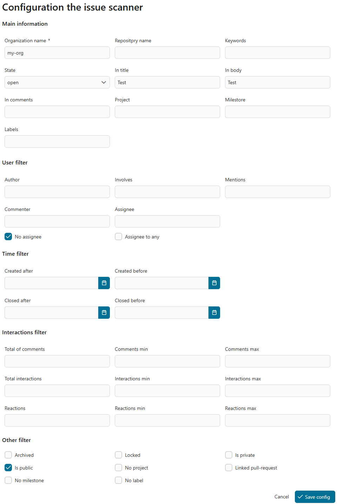
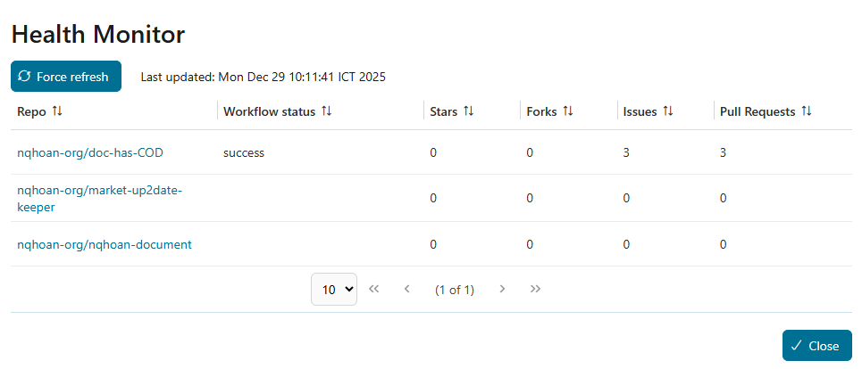

# GitHub Connector

An Axon Ivy REST API connector that integrates GitHub issues and workflows into your Ivy processes. This connector provides seamless communication with GitHub's REST API, enabling automated issue management, pull request handling, and workflow monitoring and more.

### Daily GitHub Issue Scan
- Automatically queries all open issues from a configured GitHub organization/repository
- Supports plannable execution schedules (daily, hourly, monthly, etc.)
- Retrieves comprehensive issue information for processing

### Smart Filter Logic
- Filters issues based on configurable criteria
- Supports keyword-based filtering to select relevant issues
- Customizable filtering logic for assignees and other attributes

### GitHub Issue Management
- **Issue Update**: Adds comments to GitHub issues directly from Ivy workflows
- **Automatic Assignment**: Assigns issues to configured watchers or teams
- **Patch Customization**: Override callable process to customize issue patching behavior

### Repository Services
- **Repository Service**: Full repository management capabilities
- **Pull Request Service**: Create, update, and manage pull requests
- **Workflow Run Service**: Monitor and interact with GitHub Actions workflows

### Issue Scanner Configuration
- Configurable scanning parameters
- Flexible organization and repository targeting
- Advanced search logic for issue discovery

## Demo

The GitHub Connector seamlessly integrates with Ivy workflows to provide automated GitHub issue management. Key capabilities include:

1. **Automated Issue Scanning**: Configure scheduled scans to automatically discover and retrieve new issues that match your defined criteria.  
   

2. **Issue Search**: Search and filter issues within your organization based on keywords, creation date, last updated date, or assignees.  
   

3. **Repository Management**: Browse and manage repositories within your organization.  
   

4. **Health Monitoring**: Monitor repository health status with automatic refresh when the last repository access occurred more than ten minutes prior.  
   

## Setup

### Prerequisites
- GitHub personal access token or OAuth token with appropriate permissions

### Configuration

1. **GitHub Authentication**
   - Generate a GitHub personal access token with required scopes (`repo`, `issues`, `workflow`)

2. **Organization/Repository Settings**
   - Set your target GitHub organization name
   - Configure repository(ies) to monitor

3. **Issue Scanner Configuration**
   - Define execution schedule (daily, hourly, monthly, etc.)
   - Configure filter logic:
     - Keywords to search for in issues
     - Assignee filters
     - Label-based filtering
   - Set watcher/team for automatic assignment

4. **Customization**
   - Override the callable process `/github-connector/processes/Functional Processes/PatchIssues.p.json` to customize issue patching behavior
   - Implement custom logic for specific workflows in `buildPatchIssueBody(String,String,BigInteger)` script

### Update Variables
```
@variables.yaml@
```
